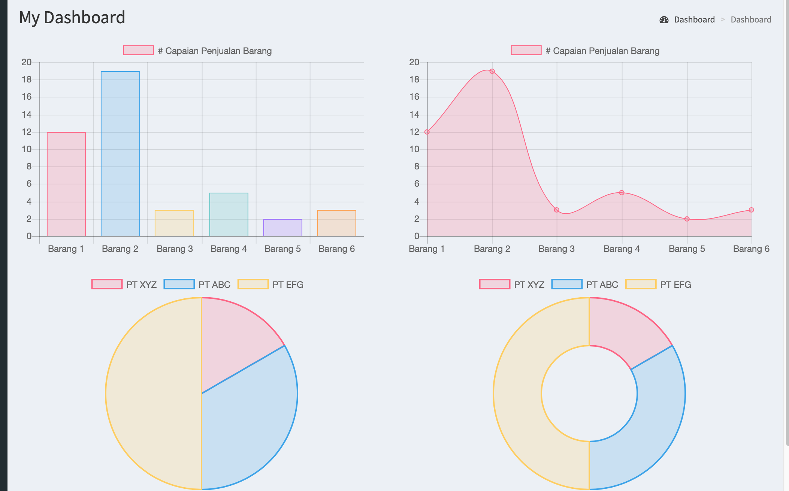

# SpringBoot with AdminLTE 2

---

Application with SpringBoot integrate with the AdminLTE 2 

Features
--------

* Spring Boot;
* Spring Security for basic login with permissions;
* Thymeleaf as view Template Engine;
* MySQL as Database or others;
* Basic Perushaan CRUD;
* Basic Barang CRUD;
* Basic Transaksi CRUD;

Run the application:
--------------------

We assume that You already installed maven and JDK 8 (minimum) on your environment.

1. Clone the repository: `git clone https://github.com/hendrik49/didok-java-adminlte.git`
2. Go to the folder: `cd spring-boot-adminlte`
3. Run the app: `mvn clean spring-boot:run`
4. Open Your favorite browser, then go to http://localhost:8080

It is free to make changes and implementations and make the code more evolved.

| # | Username | Password |
| - | :------: | -------: |
| 1 |  didok  |     1234 |

## Screenshot

Login Page

Dashboard Page

Add Barang Page

List Perusaahaan

List Barang

List Transaksi

